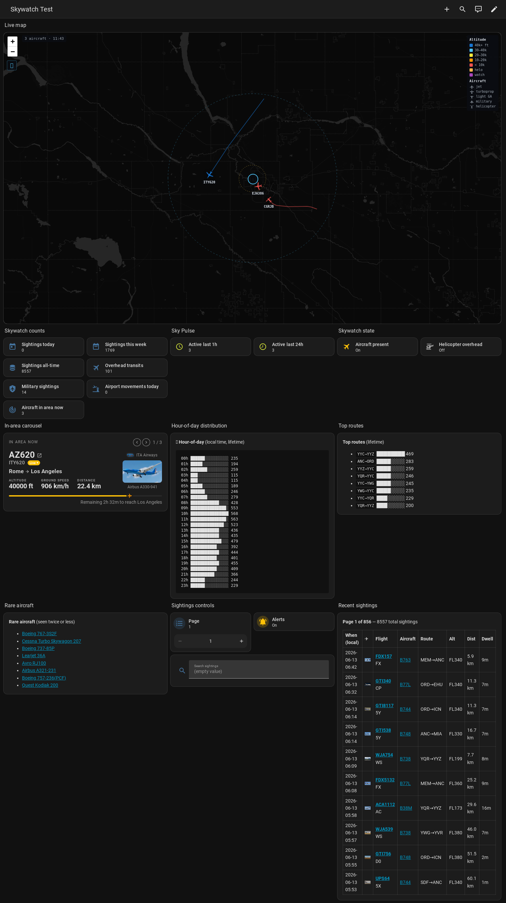

# Skywatch

Home Assistant integration that captures, persists, and surfaces aircraft sightings around your home — sensor counts, a live Leaflet map with silhouettes + trails, an importable legacy DB, and three alert blueprints. Backend-agnostic adapter contract; ships an adapter for the Flightradar24 HACS integration.

[](https://github.com/hacs/integration)



## What you get

- **13 entities** — sightings today / this week / all-time / overhead / military / movements / 1h / 24h activity / search results / hour-of-day histogram / top routes, plus `aircraft_present` and `helicopter_overhead` binary sensors
- **Per-watch sensors** — add a watch entry via the options flow (registration or "Blocked" fingerprint), get `sensor.skywatch_watch_<slug>` with lifetime count + last-seen details
- **Native control entities** — `number.skywatch_sightings_page` (with +/- buttons), `text.skywatch_search_term`, `switch.skywatch_alerts_enabled`, `button.skywatch_clear_search`
- **Live Leaflet map** at `/api/skywatch/map` — 5 aircraft silhouettes (jet / turboprop / light GA / military / helicopter), 5-tier altitude colour ramp, heading-based rotation, 30-min trail polylines, 50 km AOI + 8 km audible-range rings
- **3 blueprints** — entry alert (with helo-only / military-only filters), watch-list match alert, daily digest
- **One-shot legacy import** — `skywatch.import_legacy_db` service migrates a pre-existing sky_sightings.db into the new schema with no row loss
- **SQLite-backed persistence** at `<config>/skywatch/sightings.db` with v1 indexes for every common query

## Prerequisites

You'll need these **before** installing Skywatch:

1. **Home Assistant 2024.6.0** or newer
2. **Flightradar24 HACS integration** — [AlexandrErohin/home-assistant-flightradar24](https://github.com/AlexandrErohin/home-assistant-flightradar24) — must be configured (FR24 API key set up) before Skywatch's config flow runs, otherwise it aborts with `fr24_not_loaded`
3. **flightradar-flight-card HACS plugin** (optional but recommended) — [plckr/flightradar-flight-card](https://github.com/plckr/flightradar-flight-card) — used by the example dashboard's "In-area carousel" section

## Install

### Via HACS — custom repository (current path, while skywatch isn't in the HACS default list)

1. HACS → ⋮ → Custom repositories
2. Repository: `https://github.com/gregoryquesnel/ha-skywatch`
3. Category: `Integration`
4. Click **Add** → search "Skywatch" in HACS → Install
5. Restart Home Assistant

### Manual

```bash
ssh hassio@your-ha-host
cd /config/custom_components
git clone https://github.com/gregoryquesnel/ha-skywatch.git skywatch-src
mv skywatch-src/custom_components/skywatch ./skywatch
rm -rf skywatch-src
```

Then restart HA.

## Configure

1. Settings → Devices & Services → Add Integration → **Skywatch**
2. Fill in:
   - **Home latitude / longitude** — pre-filled from your HA location; this is the centre of the watch area
   - **Airport IATA** (optional) — your local airport's 3-letter code (e.g. `YQR`, `JFK`)
   - **Radius** — search radius in km (default 50)
3. Submit. Entities appear under **Settings → Devices & Services → Skywatch**.

### Options (post-install)

Settings → Devices & Services → Skywatch → **Configure**:

- **Watch list** — list of `{slug, label, registration, aircraft_code, match_blocked}` entries; each spawns its own `sensor.skywatch_watch_<slug>`
- **Helicopter ICAO codes** — defaults to 84-code list; override to add custom rotorcraft codes
- **Military ICAO codes** — defaults to ~50 ICAO designators (RCAF + USAF common)
- **Overhead distance / altitude thresholds** — defaults 5 km / 10,000 ft; only sightings tighter than these count as "overhead transits"

## Use

### Dashboard

The repo ships two dashboard YAMLs:

- `examples/dashboard-skywatch-test.yaml` — full v0.2 layout: counts, Sky Pulse, state tiles, live map, in-area carousel, hour histogram, top routes, rare aircraft, sightings table with photos + FlightAware/Wikipedia links, pagination controls
- `examples/dashboard-sky.yaml.template` — more elaborate template adapted from the original ha-tinker dashboard

Settings → Dashboards → **+ Add Dashboard** → "New Dashboard from YAML" → paste in.

### Recorder

The array-bearing sensors (recent sightings, military, overhead, etc.) carry ~5-15 KB attribute payloads. Without an exclude, the recorder warns about the >16 KB attribute cap. Drop into your `configuration.yaml`:

```yaml
recorder:
  exclude:
    entities:
      - sensor.skywatch_recent_sightings
      - sensor.skywatch_search_results
      - sensor.skywatch_overhead_sightings
      - sensor.skywatch_military_sightings
      - sensor.skywatch_airport_movements_today
      - sensor.skywatch_sightings_hour_of_day
```

Full reasoning + alternatives in [`docs/RECORDER_EXCLUDE.md`](docs/RECORDER_EXCLUDE.md).

### Importing your legacy DB

If you previously ran the ha-tinker sky tab's command-line script setup, your historical sightings live at `/config/sky_sightings.db`. Bring them across:

1. Developer Tools → Services → `skywatch.import_legacy_db`
2. Source path: `/config/sky_sightings.db` (default)
3. Call Service

The import is read-only on the source, transactional on the target, and writes a `.legacy_imported` sentinel next to the new DB on success.

### Blueprints

Import via blueprint URL:

- Entry alert — `https://github.com/gregoryquesnel/ha-skywatch/blob/main/blueprints/automation/skywatch/aircraft-entry-alert.yaml`
- Watch-list match alert — `https://github.com/gregoryquesnel/ha-skywatch/blob/main/blueprints/automation/skywatch/watch-list-match-alert.yaml`
- Daily digest — `https://github.com/gregoryquesnel/ha-skywatch/blob/main/blueprints/automation/skywatch/daily-digest.yaml`

Settings → Automations & Scenes → Blueprints → **Import Blueprint** → paste URL.

## Troubleshooting

| Symptom | Likely cause | Fix |
|---|---|---|
| Config flow aborts with `fr24_not_loaded` | FR24 HACS integration not configured | Install + configure FR24 first; then add Skywatch |
| `/api/skywatch/map` returns 404 | Browser cached an empty response from before install | Hard-refresh the dashboard (Ctrl+Shift+R) |
| Sightings stuck at 0 | Coordinator hasn't seen an FR24 exit event yet | Wait for an aircraft to leave the radius; or `skywatch.import_legacy_db` to backfill |
| Recorder warns "attributes exceed 16384 bytes" | Recorder excludes not applied | See [docs/RECORDER_EXCLUDE.md](docs/RECORDER_EXCLUDE.md) |
| Dashboard tile shows no icon | Stale MDI cache | Ctrl+Shift+R; if persistent, verify the icon name at [pictogrammers.com](https://pictogrammers.com/library/mdi/) |
| `active_last_1h` = 0 despite visible aircraft | Pre-v0.2.1 bug | Update to v0.2.0+ — current versions add the in-area count |

## Architecture

- **Backend adapter** — `backends/base.py` defines the source interface; `backends/fr24.py` is the FR24 implementation. Other backends (dump1090, tar1090, ADSB-Hub) drop in as new files.
- **Storage** — pure-Python sync sqlite3 with PRAGMA `user_version` migrations. Tests run against `tmp_path` SQLite, no HA fixtures needed.
- **Coordinator** — bridges source events to storage, runs the dashboard queries every 30 s, captures live positions every 5 s for trails.
- **Platforms** — sensor / binary_sensor / number / text / switch / button, all bound to a single `Skywatch` device.

Planning artifacts (gap analysis, test strategy, code inventory) under [`docs/planning/`](docs/planning/).

## Status

- **v0.2.0** — current; 164 unit tests, lint clean, hassfest passes, manually verified end-to-end on HA 2026.6
- **Roadmap** — quiet-hours time entities, per-watch alert switches, blueprint updates to consume them, optional Lovelace card

## License

[MIT](LICENSE) — Gregoy Quesnel, 2026.
